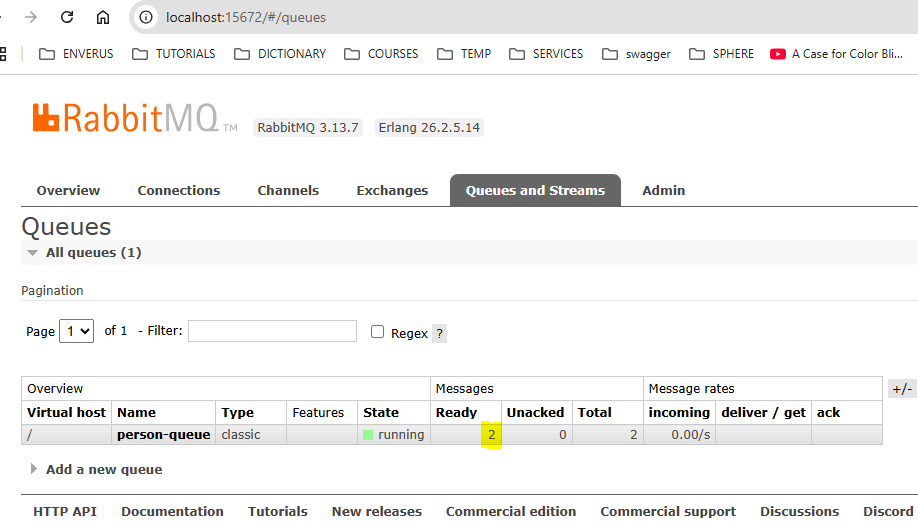
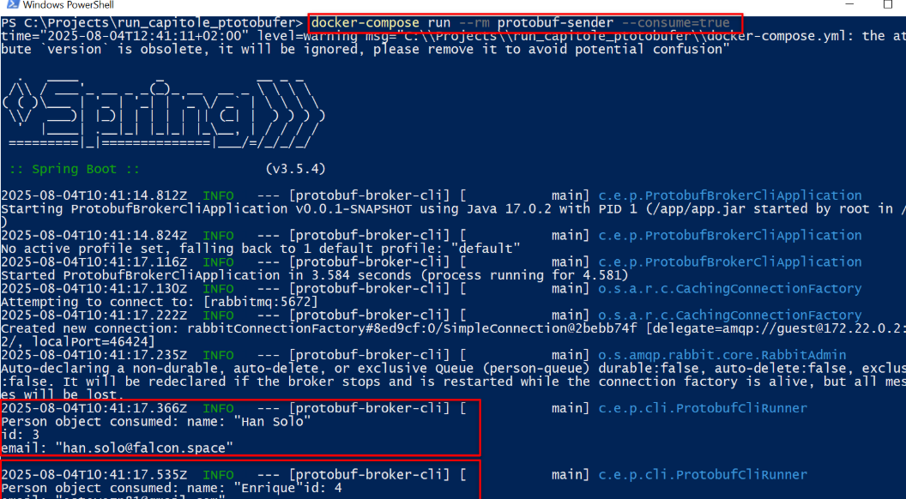

# protobuf-sender
This project provides a CLI tool that serializes a JSON file into a [Protocol Buffers](https://developers.google.com/protocol-buffers) message and sends it to a RabbitMQ queue.
It also supports consuming messages from the queue using a parameter.  
The name of the queue is configurable, for our tests we use (**person-queue**)
It is developed using Java 17+ and Spring Boot.

The protobuf message used is:

```proto
message Person {
  required string name = 1;
  required int32 id = 2;
  optional string email = 3;
}
```
The protobuf has been compiled to a Java class using **protoc-31.1-win64.zip** (https://github.com/protocolbuffers/protobuf/releases/tag/v31.1)

## Start RabbitMQ

Run RabbitMQ and its management console with the following command:

```bash
docker-compose up rabbitmq
```
This will start the RabbitMQ broker and the management console, accessible at:
**http://localhost:15672**

Use the default credentials:  
- Username: **guest**  
- Password: **guest**  

## Build the application image
Before running the sender, make sure to build the Docker image for the protobuf-sender service:

```bash
docker-compose build protobuf-sender
```
##  Sending files to RabbitMQ
To send a file stored locally, mount the folder containing the file as a volume inside the container, and specify the file path with the --file parameter:  

Example for a file stored at C:/tmp/folder1/example1.json:
```bash
docker-compose run --rm -v "C:/tmp/folder1:/app/data" protobuf-sender --file=/app/data/example1.json
```
Example for a file stored at C:/tmp/folder2/example2.json:

```bash
docker-compose run --rm -v "C:/tmp/folder2:/app/data" protobuf-sender --file=/app/data/example2.json
```
Using the RabbitMQ management console, we can see the messages are available for any consumer with access to the broker:  

  

An example of the JSON format supported is:
```json
{
  "name": "Han Solo",
  "id": 3,
  "email": "han.solo@falcon.space"
}
```
##  Consuming Messages from RabbitMQ  
The tool can also consume messages from the RabbitMQ queue and log them.
Use ```--consume=true``` to run the tool as a consumer, reading messages from the queue instead of sending..
**Example**:
```bash
docker-compose run --rm protobuf-sender --consume=true
```  
  

## Notes ##
- The application exits automatically after sending or consuming messages. For example, here is a simple Python consumer using pika:
```python
import pika

connection = pika.BlockingConnection(pika.ConnectionParameters('localhost'))
channel = connection.channel()

channel.queue_declare(queue='person-queue')

def callback(ch, method, properties, body):
    print(f"Received raw message: {body}")

channel.basic_consume(queue='person-queue',
                      on_message_callback=callback,
                      auto_ack=True)

print('Waiting for messages. To exit press CTRL+C')
channel.start_consuming()
```

- Messages remain in the queue until consumed by any client.

- RabbitMQ must be running before sending or consuming messages.